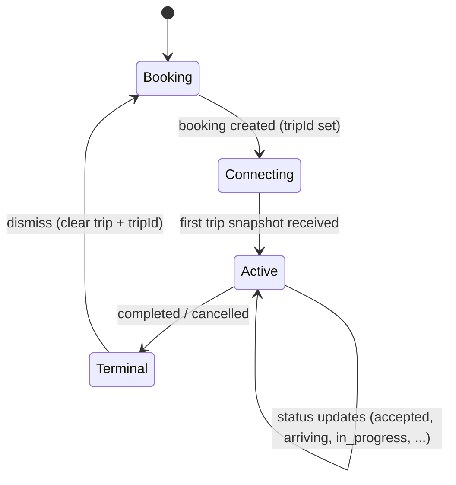
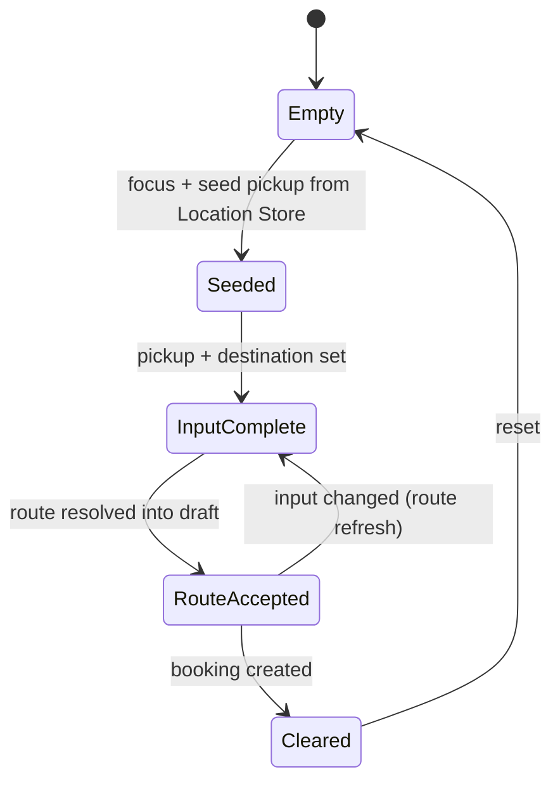
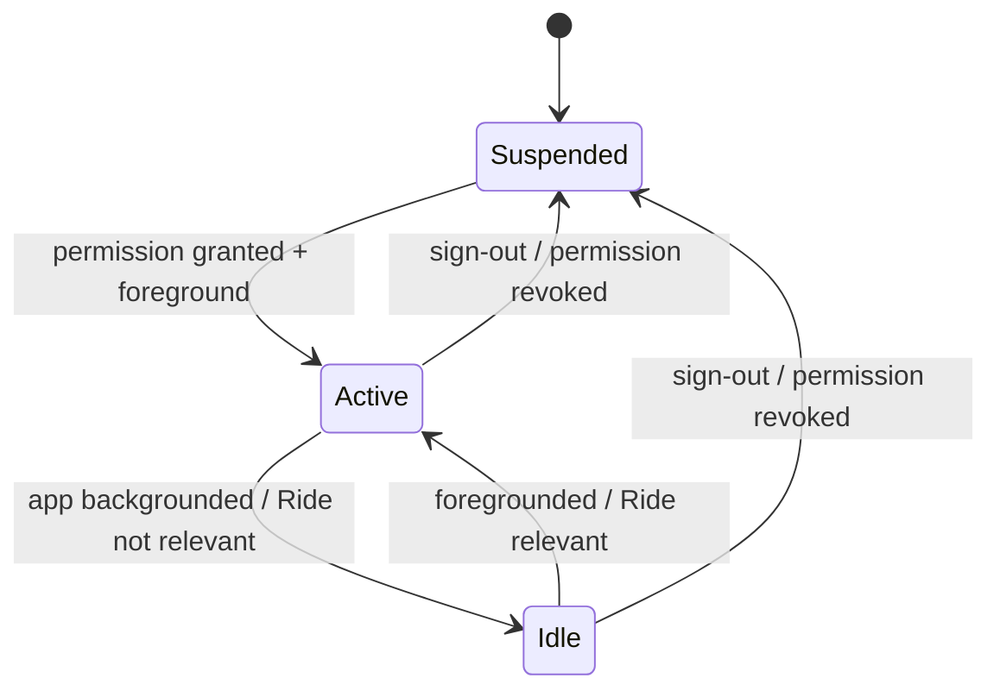
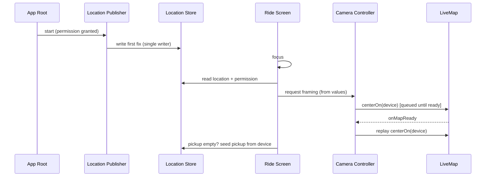
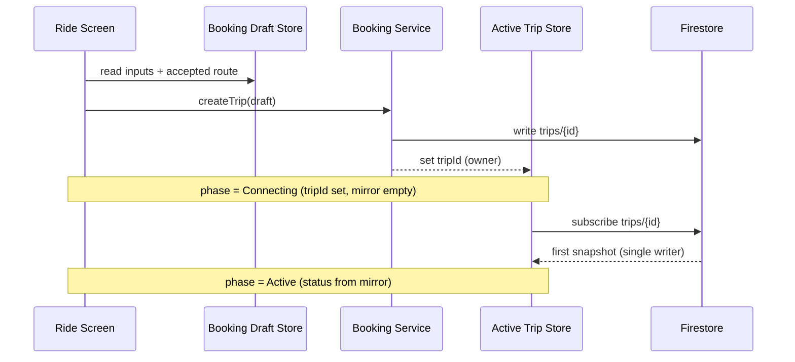
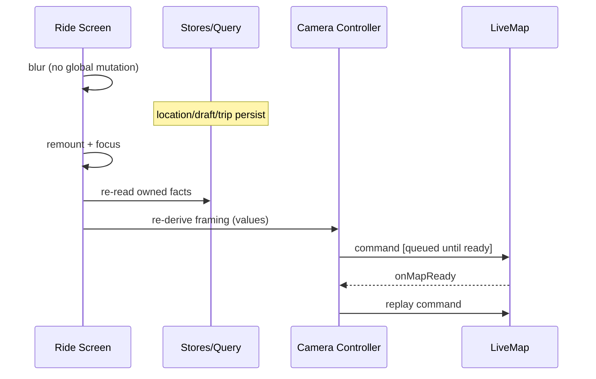

# Passenger Ride Architecture

> **Status:** Finalized — source of truth before implementation.
> **Scope:** The passenger-side Ride module (`(passenger)/ride.tsx`, `LiveMap`, the
> booking/location/active-trip stores, the route query, and the camera controller).
> **Stack:** Expo Router · React Native Maps · Zustand · TanStack Query · Cloud Firestore.
>
> This document is descriptive of an agreed design. It does not contain implementation
> code and must not be used to introduce new architecture. Any change to the ownership
> model described here is an architecture change and requires updating this document
> first.

---

## Table of Contents

1. [Executive Summary](#1-executive-summary)
2. [Design Goals](#2-design-goals)
3. [Problems with the Existing Architecture](#3-problems-with-the-existing-architecture)
4. [Core Design Principles](#4-core-design-principles)
5. [Source-of-Truth Ownership](#5-source-of-truth-ownership)
6. [Store Responsibilities](#6-store-responsibilities)
7. [Data Flow](#7-data-flow)
8. [State Lifecycles](#8-state-lifecycles)
9. [Camera Architecture](#9-camera-architecture)
10. [Location Architecture](#10-location-architecture)
11. [Booking Draft Lifecycle](#11-booking-draft-lifecycle)
12. [Active Trip Lifecycle](#12-active-trip-lifecycle)
13. [Route Lifecycle](#13-route-lifecycle)
14. [Screen Focus / Blur / Remount Lifecycle](#14-screen-focus--blur--remount-lifecycle)
15. [GPS Initialization](#15-gps-initialization)
16. [Transitioning / Connecting Phase](#16-transitioning--connecting-phase)
17. [Camera Remount Contract](#17-camera-remount-contract)
18. [Location Publisher Modes](#18-location-publisher-modes)
19. [tripId Ownership](#19-tripid-ownership)
20. [State Transition Diagrams](#20-state-transition-diagrams)
21. [Sequence Diagrams](#21-sequence-diagrams)
22. [Ownership Tables](#22-ownership-tables)
23. [Invariants](#23-invariants)
24. [Migration Strategy](#24-migration-strategy)
25. [Testing Strategy](#25-testing-strategy)
26. [Future Extensions](#26-future-extensions)

---

## 1. Executive Summary

The Passenger Ride module presents an interactive map and a status-driven bottom sheet
that together drive the passenger through booking a ride and following an active trip.
The previous implementation suffered from a class of defects — straight-line routes,
disappearing markers, a camera that would not restore, a missing user-location dot, and
pickup/current-location confusion — that all share a single root cause: **state with no
clear owner, and multiple components writing the same fact.**

This specification defines an architecture in which **every piece of state has exactly
one authoritative owner**, chosen by the nature of the fact rather than by which screen
happens to render it. The module is organized around five owners:

- a dedicated **Location Store** for the device's own position;
- a **Booking Draft Store** that owns both booking *input* and the *accepted booking route*;
- **TanStack Query** as the *mechanism* that obtains and refreshes routes (never their owner);
- an **Active Trip Store** that is a strictly read-only mirror of Firestore;
- a **Ride Camera Controller** that owns all camera behavior, with `LiveMap` reduced to a
  controlled, presentational component.

The Ride screen itself owns no durable state. As a result, focus, blur, remount, and tab
switching all reduce to deterministic re-reads of owned state, eliminating the entire
class of lifecycle-dependent defects.

---

## 2. Design Goals

| # | Goal | Meaning |
|---|------|---------|
| G1 | **Single ownership** | Every fact has exactly one authoritative owner. No fact is writable from two places. |
| G2 | **Determinism across lifecycle** | Focus, blur, remount, and tab switch produce identical, predictable results from owned state. |
| G3 | **Separation of concerns by fact category** | Server truth, derived data, device-ephemeral truth, user intent, and view-local control are kept in distinct owners. |
| G4 | **Controlled presentation** | The map renders what it is told. It never originates camera or state decisions. |
| G5 | **No cross-feature mutation** | A subscription for one concern (e.g. the trip) never mutates state owned by another concern (e.g. the booking draft). |
| G6 | **Resilience to component teardown** | Durable state lives in stores/queries, not component state, so destroying a screen instance loses nothing. |
| G7 | **Explicit, observable phases** | Booking, connecting, and active phases are explicit and inspectable, not inferred from incidental conditions. |

---

## 3. Problems with the Existing Architecture

The following defects motivated this design. They are recorded here so future contributors
understand *why* the ownership boundaries are drawn as they are.

| Symptom | Underlying architectural fault |
|---------|--------------------------------|
| Passenger route sometimes becomes a straight line | The route was nulled as a side effect of every pickup/destination write, then re-fetched asynchronously; any gap or failed fetch left a straight-line fallback. The route had no stable owner. |
| Pickup/destination markers disappear | Markers were resolved ad-hoc from `trip ?? draft`, and the trip subscription reset the booking draft across feature boundaries. |
| Camera fails to restore after returning to Ride | The camera lived as an uncontrolled side effect inside the map, keyed on marker *presence* rather than coordinate *values*, with no owner to re-derive framing on return. |
| First launch does not center on current location | There was no current-location source of truth; centering depended on the pickup marker appearing, which itself depended on a multi-step async resolve. |
| Blue user-location dot appears only after leaving and returning | The device's own location was never a first-class fact on the passenger screen; it was folded into the pickup value. |
| Dragging to the current location is treated as the pickup marker | Device location and pickup were the same field. There was no separate concept of "where the device is" versus "where the trip starts." |

The common thread: **device location, pickup, and route were conflated, and several
components wrote the same state.** This specification removes that conflation.

---

## 4. Core Design Principles

> **P1 — One fact, one owner.**
> Each piece of state has exactly one authoritative writer. All other consumers read.

> **P2 — Owners are chosen by the nature of the fact.**
> Server truth → Firestore mirror. Derived data → fetched by a mechanism but owned by the
> consumer that persists it. Device-ephemeral truth → a dedicated store with one writer.
> User intent → the draft store. View-local control → component state / controller.

> **P3 — Device location, pickup, and route are three different facts.**
> They may never share a field. Pickup may be *seeded* from device location but is
> thereafter independent.

> **P4 — The map is controlled and presentational.**
> `LiveMap` renders the markers, polylines, and camera it is handed. It originates no
> camera logic and holds no autonomous fitting behavior.

> **P5 — No cross-feature side-effect mutation.**
> The active-trip subscription never resets the booking draft. The booking draft is cleared
> only by explicit, intentional actions.

> **P4a — Never synthesize geometry to cover missing data.**
> The Ride screen must never draw a straight-line (or any synthetic) route as a fallback for
> a route that is loading, refetching, or recovering. Missing route data is handled by state
> (retain the last valid route, or show a loading state), never by inventing a line.

> **P6 — The Ride screen owns nothing durable.**
> All durable state lives in stores or queries, so the screen can be unmounted and
> recreated freely.

> **P7 — Phases are explicit.**
> The booking, connecting, and active phases are represented as explicit, derivable state,
> not inferred from the incidental presence of other values.

---

## 5. Source-of-Truth Ownership

The module recognizes five categories of fact and assigns each a single owner.

| Category | Owner | Examples |
|----------|-------|----------|
| **Device-ephemeral truth** | **Location Store** (Zustand) | current coordinates, heading, accuracy, permission status |
| **User intent + accepted booking route** | **Booking Draft Store** (Zustand) | pickup, destination, passenger count, **accepted booking route** |
| **Route acquisition mechanism** | **TanStack Query** | fetching and refreshing route candidates from the routing service |
| **Server truth** | **Active Trip Store** (Zustand, read-only mirror) | trip document, status, driverId, persisted trip route, driver location |
| **View-local control** | **Ride screen state + Ride Camera Controller** | search mode, sheet minimized, camera intent/commands |

Two clarifications are central to this design and override any earlier draft:

- **The booking route is owned by the Booking Draft Store**, not by TanStack Query.
  TanStack Query is the *mechanism* used to obtain and refresh a route. The *accepted*
  route — the one the booking will be created from — is persisted in the draft store
  alongside the inputs it was derived from.
- **The Active Trip Store is strictly read-only** with respect to the application. Only its
  single Firestore subscription writes to it; every component reads.

---

## 6. Store Responsibilities

### 6.1 Location Store (device-ephemeral)
- **Owns:** the device's current location and related signals — coordinates, heading,
  accuracy, timestamp, and permission status.
- **Single writer:** the Location Publisher (see §10, §18). No screen writes to it.
- **Lifetime:** root/session-scoped — independent of the Ride screen's mount state.
- **Consumers:** the blue user-location dot, GPS initialization of pickup, the camera
  controller's centering logic.

### 6.2 Booking Draft Store (user intent + accepted route)
- **Owns:** `pickup`, `destination`, `passengerCount`, and the **accepted booking route**
  (distance, duration, polyline).
- **Writers:** Ride-screen user actions (search selection, pin drag) for inputs; the route
  acquisition flow writes the *accepted route* into the draft once a route resolves for the
  current inputs.
- **Lifetime:** session-scoped. Seeded once from the Location Store when empty; cleared
  only on successful booking creation or an explicit "start over."
- **Rule:** the draft is **never** reset as a side effect of the trip subscription.

### 6.3 TanStack Query (route mechanism only)
- **Responsibility:** obtain and refresh routes for a given pickup/destination pair.
- **Not an owner:** the query result is not the durable route. Once a result is accepted it
  is written into the Booking Draft Store, which owns it from then on.
- **Keying:** by **rounded coordinate values**, so identical coordinates never trigger a
  redundant fetch and reference churn cannot invalidate the cache.

### 6.4 Active Trip Store (read-only Firestore mirror)
- **Owns:** the mirrored trip document — status, pickup, destination, persisted route,
  driver route, driverId — plus the passenger-observed driver location and any
  navigation-ephemeral fields.
- **Single writer:** the active-trip subscription (and, for driver location, its dedicated
  subscription). Application code reads only.
- **Lifetime:** trip-scoped — subscribes when a `tripId` exists, tears down when the trip
  ends.

### 6.5 Ride screen state + Ride Camera Controller (view-local)
- **Owns:** `searchMode`, `isMinimized`, pin-revert signals, and all camera intent.
- **Lifetime:** view-scoped — dies with the screen and is rebuilt deterministically on
  remount/focus.

---

## 7. Data Flow

```mermaid
flowchart TD
  GPS[Device GPS / Permission] -->|single writer| LS[Location Store]
  LS -->|seed when empty| BD[Booking Draft Store]
  LS -->|blue dot + centering| CAM[Ride Camera Controller]

  UI[Ride screen user actions] -->|pickup / destination / seats| BD
  BD -->|coords| RQ[TanStack Query: route mechanism]
  RQ -->|accepted route| BD

  FS[(Firestore trips/{id})] -->|subscription, single writer| ATS[Active Trip Store]
  FSD[(Firestore drivers/{id})] -->|subscription, single writer| ATS

  BD -->|booking phase facts| SEL[Render Selector]
  ATS -->|active phase facts| SEL
  SEL --> MAP[LiveMap controlled/presentational]
  CAM -->|camera commands| MAP
  LS -->|own location| MAP
```

Key properties of the flow:
- The route returns from the query **into the draft store**; the draft store is what the
  rest of the system reads.
- A single **render selector** resolves which facts feed the map based on the current phase
  (booking vs. active). Components do not perform ad-hoc `trip ?? draft` resolution.
- The map receives data and camera commands; it sends back only user-interaction signals
  (e.g. "user panned").

---

## 8. State Lifecycles

| State | Created | Persists across | Cleared / torn down |
|-------|---------|-----------------|---------------------|
| Device location | At session start / permission grant | Tab switch, Ride remount, blur | Sign-out; background per publisher mode |
| Booking draft (inputs) | On first Ride focus (seeded) | Tab switch, remount, blur | Successful booking; explicit reset |
| Accepted booking route | When a route resolves for current inputs | Same as draft | Replaced on input change; cleared with draft |
| Route query cache | On enable (both coords present) | Per TanStack Query GC policy | Query GC; value-key change |
| Active trip mirror | When `tripId` is set | Until trip ends | Trip terminal / cleared `tripId` |
| Driver location | While trip is in a driver-active status | Within active trip | Status leaves active set; subscription teardown |
| Camera intent | On focus / remount | View lifetime | Blur / unmount (no global effect) |
| View UI (search, minimized) | On mount | View lifetime | Blur / unmount |

---

## 9. Camera Architecture

### 9.1 Ownership
The **Ride Camera Controller** is the single owner of all camera behavior. `LiveMap` is a
controlled, presentational component: it executes camera commands and renders handed-in
markers and polylines, and it originates no fitting or following logic of its own.

### 9.2 Command model
The controller emits one of a small set of explicit commands:

- `fit(coordinates[])` — frame a set of points.
- `centerOn(coordinate)` — center on a single point.
- `follow(coordinate, heading)` — track a moving point with heading.
- `overview` — return to a non-following framing.

### 9.3 Inputs to the controller
- Resolved marker coordinates as **values** (not presence booleans).
- The current trip **phase**.
- A `userPanned` signal forwarded from the map.

### 9.4 Behavioral rules
- The camera re-frames on coordinate **value** changes, not on marker presence.
- A `userPanned` signal switches the controller to `overview` and suppresses auto-follow
  until an explicit recenter, so the camera never fights the user.
- Commands issued before the native map is ready are **queued and replayed** when the map
  reports ready (see the Camera Remount Contract, §17). The controller never relies on a
  timing guess.

---

## 10. Location Architecture

### 10.1 Ownership
Device location is owned by the **Location Store** and written by a **single Location
Publisher** running above the tab layer. The Ride screen and the map **read** location;
they never write it.

### 10.2 Decoupling from pickup
Pickup is **seeded** from device location when the draft is empty, then becomes
independent. Moving the device updates the blue dot; it does not rewrite pickup. Dragging
the pickup pin updates pickup; it does not move the device dot. This separation is what
removes pickup/current-location confusion.

### 10.3 Permission as first-class state
Permission status lives in the Location Store. The screen reads an explicit permission
value rather than inferring permission from the absence of a pickup.

---

## 11. Booking Draft Lifecycle

1. **Seed:** on first Ride focus, if the draft has no pickup, seed pickup from the Location
   Store (idempotent — never overwrites a user choice).
2. **Edit:** the user sets/changes pickup or destination (via search or pin drag) and seat
   count. These writes update inputs only.
3. **Route resolve:** when both endpoints exist, the route mechanism (TanStack Query)
   fetches a route; the **accepted route is written into the draft**, which owns it.
4. **Book:** on confirm, the trip is created from the draft (inputs + accepted route).
5. **Clear:** the draft is cleared **only** on successful booking creation or an explicit
   "start over." It is never cleared by the trip subscription.

---

## 12. Active Trip Lifecycle

1. **Set `tripId`:** booking creation sets the authoritative `tripId` (see §19).
2. **Subscribe:** the active-trip subscription begins and mirrors `trips/{tripId}` into the
   Active Trip Store (single writer).
3. **Mirror:** status, pickup, destination, persisted route, and driver route are read from
   the mirror while the trip is active. The draft is no longer consulted for rendering.
4. **Driver location:** a dedicated subscription mirrors driver location while the trip is
   in a driver-active status.
5. **Terminal:** on completion/cancellation the trip reaches a terminal status; dismissal
   clears the trip and `tripId`.

---

## 13. Route Lifecycle

- **Acquisition:** TanStack Query fetches a route for the current pickup/destination,
  keyed by **rounded coordinate values**.
- **Acceptance & ownership:** the resolved route is written into the **Booking Draft
  Store**, which owns the accepted booking route. The query is the mechanism, not the
  owner.
- **Refresh:** when inputs change, the query refetches; the newly accepted route replaces
  the one held in the draft.
- **Active phase:** once a trip exists, the authoritative route for rendering is the
  **persisted trip route** from the Active Trip Store. The draft route applies only to the
  pre-booking phase.
- **No side-effect nulling:** changing pickup/destination updates inputs and triggers a
  refresh; it does not leave the system in a route-less state.

### 13.1 No synthesized straight-line fallback

The passenger Ride screen **must never synthesize a straight-line route as a fallback for
missing route data.** A line drawn directly between pickup and destination is an artificial
artifact that misrepresents the actual route and is therefore prohibited.

Route disappearance is a **state-management concern, not a rendering concern.** The map
renders only what the owner provides; it never invents geometry to cover a gap.

### 13.2 Route availability states

The accepted booking route, owned by the Booking Draft Store, is rendered according to an
explicit availability state. There is no fourth "draw a straight line" branch.

| Situation | Required behavior |
|-----------|-------------------|
| A valid route exists for the current (or most recent) inputs | Render that route. |
| A route is **loading, refetching, or recovering after remount**, and a previously valid route exists | **Keep the last valid route visible** until a new one resolves. Do not clear it, and do not replace it with a straight line. |
| No valid route has **ever** been computed for the current inputs | Present an explicit **loading state**. Render no route geometry — never an artificial line. |
| Inputs changed and a new route is being fetched | Treat as "loading/refetching": retain the last valid route if one exists; otherwise show the loading state. |

### 13.3 Last-valid-route retention

To satisfy the rules above, the **last valid route is retained by its owner (the Booking
Draft Store)** across loading, refetch, and remount. A pending fetch never nulls the held
route; the held route is replaced only when a new valid route resolves, or cleared only
when the draft itself is cleared (successful booking or explicit reset). This retention is
the mechanism that makes route persistence a state concern rather than something the
renderer must paper over.

> **Note on `LiveMap`:** because `LiveMap` is controlled and presentational (P4), it has no
> authority to synthesize geometry. Any straight-line fallback in the presentation layer is
> a violation of this contract and must be removed, not relocated.

---

## 14. Screen Focus / Blur / Remount Lifecycle

### 14.1 Focus
On gaining focus the Ride screen:
1. Reads current facts from the Location Store, Booking Draft Store, and Active Trip Store
   (no unnecessary refetch).
2. Seeds pickup from the Location Store **only if** the draft pickup is empty.
3. Asks the Camera Controller to **re-derive framing from current coordinate values** and
   issue the appropriate command (queued until the map is ready).
4. Does **not** clear or reset any store.

### 14.2 Blur
- No global state is mutated on blur. No store reset, no draft clear, no camera teardown
  that other consumers depend on.
- The Location Publisher keeps running (root-scoped), so re-focus is instant and the blue
  dot is already live.
- View-local UI state may reset on blur but must not touch booking/location/trip stores.

### 14.3 Remount
- Because all durable facts live in stores or queries, remount is a **pure re-read**.
- Only view-local UI state and the map instance are rebuilt.
- On remount the camera controller treats it as a focus: re-derive framing from owned
  coordinates and queue commands until the map is ready (see §17).

### 14.4 Tab switching
- Expo Router `Tabs` may unmount the inactive screen; this is acceptable by design because
  the Ride screen owns no durable state.
- Switching away triggers blur (no global mutation). Switching back triggers remount +
  focus → re-read + re-derive camera. The result is identical and deterministic every time.

---

## 15. GPS Initialization

GPS initialization defines how the device location becomes available and how it seeds the
booking draft.

1. **Permission resolution** is performed and stored in the Location Store as first-class
   state.
2. **Publisher start:** once permission is granted, the Location Publisher begins writing
   location into the Location Store (root-scoped, see §18).
3. **First-fix handling:** until a first fix is available, consumers treat location as
   "unknown" via the permission/availability state rather than a missing value masquerading
   as a missing pickup.
4. **Pickup seeding:** the first valid fix seeds the booking draft pickup **only if** the
   draft pickup is empty (idempotent). Subsequent fixes update the device dot only.
5. **Camera centering:** the camera controller centers on the device location on first
   availability, independent of whether a pickup has been chosen.

---

## 16. Transitioning / Connecting Phase

A temporary **Transitioning / Connecting** lifecycle state exists between the moment a
booking is created and the moment the first authoritative trip snapshot arrives from
Firestore.

- **Purpose:** to represent the window after `tripId` is set but before the Active Trip
  Store has mirrored the first snapshot, so the UI is never forced to infer status from
  partial state.
- **Entry:** booking creation sets `tripId`; the phase becomes Connecting.
- **Exit:** the first trip snapshot arrives and the phase becomes the trip's actual status.
- **Rendering:** during Connecting, the screen shows a connecting affordance and the map
  continues to render the last known booking facts — including the **last valid route,
  retained per §13.3**; it does not flicker between booking and active fact sets, and it
  never substitutes a straight line.
- **Ownership:** the Connecting phase is **derived** from `tripId` being present while the
  trip mirror is not yet populated; it is not a separately writable flag in multiple places.

---

## 17. Camera Remount Contract

The Camera Remount Contract guarantees deterministic camera behavior across map
recreation.

1. **The camera is never stored in the dead component.** Camera intent is owned by the
   controller and derived from owned coordinates and phase.
2. **Commands are idempotent and replayable.** Re-issuing the framing command for the same
   inputs produces the same camera.
3. **Map-ready gating.** Commands issued before the native map reports ready are queued and
   replayed on the map-ready signal. The controller never fires into a timing race.
4. **Re-derive, don't remember.** On remount/focus the controller recomputes framing from
   current coordinate values rather than restoring a saved camera position.
5. **User-pan precedence persists logically.** If the user had panned to overview, the
   controller's overview intent is re-derived from owned state, not lost by the remount.

---

## 18. Location Publisher Modes

The Location Publisher is lifecycle-aware and runs in explicit modes to balance accuracy
against battery, without ever surrendering ownership of device location.

| Mode | When active | Behavior |
|------|-------------|----------|
| **Foreground / Active** | Passenger session foregrounded, Ride relevant | Higher-frequency updates suitable for live centering and the blue dot. |
| **Background / Idle** | App backgrounded or Ride not relevant | Reduced-frequency or paused updates per battery policy; location remains last-known. |
| **Suspended** | Sign-out / permission revoked | Publisher stops; Location Store reflects unavailable/permission state. |

Properties:
- The publisher is **root/session-scoped**, not tied to the Ride screen mount.
- Mode transitions change *frequency/activity*, never *ownership* — the Location Store
  remains the single source of truth with a single writer in every mode.

---

## 19. tripId Ownership

`tripId` is owned by the **Active Trip Store**.

- **Set by:** booking creation, on success, writing the newly created trip's id into the
  Active Trip Store. This is the authoritative trigger that begins the active-trip
  lifecycle.
- **Read by:** the active-trip subscription (to know what to subscribe to) and the phase
  derivation (Connecting/active).
- **Cleared by:** trip dismissal / teardown when a trip reaches a terminal status.
- **Rule:** `tripId` is never written from more than one conceptual place. Booking creation
  sets it; trip teardown clears it. No other code path mutates it.

---

## 20. State Transition Diagrams

### 20.1 Ride phase



### 20.2 Booking draft



### 20.3 Location publisher mode



---

## 21. Sequence Diagrams

### 21.1 Cold launch → first center → pickup seed



### 21.2 Booking → Connecting → Active



### 21.3 Tab switch away and back



---

## 22. Ownership Tables

### 22.1 Authoritative owner per state

| State | Owner | Writer(s) | Readers |
|-------|-------|-----------|---------|
| Device location (coords, heading, accuracy) | Location Store | Location Publisher (single) | Blue dot, camera controller, pickup seeding |
| Location permission status | Location Store | Location Publisher / permission flow | Ride screen, publisher |
| Pickup | Booking Draft Store | Ride user actions; seed-from-location (when empty) | Render selector, route mechanism, booking |
| Destination | Booking Draft Store | Ride user actions | Render selector, route mechanism, booking |
| Passenger count | Booking Draft Store | Ride user actions | Booking |
| Accepted booking route | Booking Draft Store | Route acceptance flow | Render selector (booking phase), booking |
| Route fetch/cache | TanStack Query | Query mechanism | Route acceptance flow |
| Trip document (status, endpoints, persisted route, driver route, driverId) | Active Trip Store | Active-trip subscription (single) | Render selector (active phase), phase derivation |
| Driver location (passenger view) | Active Trip Store | Driver-location subscription (single) | Map (driver marker) |
| `tripId` | Active Trip Store | Booking creation (set); teardown (clear) | Subscription, phase derivation |
| Camera intent / commands | Ride Camera Controller | Camera controller (single) | LiveMap |
| Search mode | Ride screen | Ride screen | Ride screen |
| Sheet minimized | Ride screen | Ride screen | Ride screen |

### 22.2 Lifecycle scope per owner

| Owner | Scope | Survives remount? | Survives tab switch? |
|-------|-------|-------------------|----------------------|
| Location Store | Session/root | Yes | Yes |
| Booking Draft Store | Session | Yes | Yes |
| TanStack Query cache | Query GC policy | Yes | Yes |
| Active Trip Store | Trip | Yes | Yes |
| Ride Camera Controller | View | No (re-derived) | No (re-derived) |
| Ride screen UI state | View | No | No |

---

## 23. Invariants

These invariants must hold at all times. A violation is a bug and, if intentional, an
architecture change requiring this document to be updated first.

- **I1.** Every state in §22.1 has exactly one authoritative owner and one conceptual
  writer path.
- **I2.** Device location, pickup, and route never share a field.
- **I3.** The Active Trip Store is written only by its subscriptions; no application code
  writes to it.
- **I4.** The booking draft is cleared only by successful booking creation or explicit
  reset — never by the trip subscription.
- **I5.** TanStack Query never holds the authoritative booking route; the accepted route
  lives in the Booking Draft Store.
- **I6.** `LiveMap` originates no camera logic; all camera commands come from the Camera
  Controller.
- **I7.** Camera commands are idempotent and gated on map-ready (Camera Remount Contract).
- **I8.** The Ride screen owns no durable state; focus/blur/remount/tab-switch are pure
  re-reads.
- **I9.** `tripId` is set only by booking creation and cleared only by trip teardown.
- **I10.** Route query keys are value-based (rounded coordinates), never reference-based.
- **I11.** The Location Publisher's mode affects frequency/activity only, never ownership.
- **I12.** Phase (Booking / Connecting / Active / Terminal) is derived from owned state, not
  stored redundantly.
- **I13.** The Ride screen never renders a synthesized straight-line (or otherwise
  artificial) route. Missing route data is resolved by state, not by the renderer.
- **I14.** While a route is loading, refetching, or recovering after remount, a previously
  valid route remains visible; a pending fetch never nulls the held route.
- **I15.** When no valid route has ever been computed for the current inputs, the UI shows an
  explicit loading state and renders no route geometry.

---

## 24. Migration Strategy

The migration moves the existing module to this architecture without changing user-facing
behavior beyond fixing the listed defects. Suggested sequencing:

1. **Introduce the Location Store and Publisher.** Stand up device-location ownership above
   the tab layer and render the blue dot from it. Do not yet remove the pickup-as-location
   coupling.
2. **Decouple pickup from device location.** Switch pickup seeding to the idempotent
   "seed when empty" rule, reading from the Location Store. Device movement no longer
   rewrites pickup.
3. **Move route ownership into the Booking Draft Store.** Keep TanStack Query as the
   fetch mechanism; write the accepted route into the draft and read the route from the
   draft everywhere in the booking phase. Make query keys value-based.
4. **Make the Active Trip Store strictly read-only.** Remove any cross-feature mutation
   (notably the draft reset from the trip subscription). Route booking-creation through the
   single `tripId` setter.
5. **Extract the Ride Camera Controller and make `LiveMap` controlled.** Remove the map's
   internal fitting effects; route all camera commands through the controller with
   map-ready gating (Camera Remount Contract).
6. **Introduce the Connecting phase** between booking creation and the first snapshot.
7. **Verify lifecycle determinism** across focus, blur, remount, and tab switch.

Each step is independently shippable and should preserve behavior except for the targeted
defect fixes.

---

## 25. Testing Strategy

| Area | What to verify |
|------|----------------|
| Ownership invariants | No state is written from two conceptual paths; the trip subscription does not mutate the draft (I1–I5, I9). |
| Location | Single writer to the Location Store; blue dot renders from device location; permission state is first-class (§10, §15). |
| Pickup decoupling | Device movement does not change pickup; dragging pickup does not move the device dot (I2). |
| Route | Accepted route lives in the draft; value-based keys prevent redundant refetch; no straight-line state from a lost route (§13, I5, I10). |
| Route availability & no-fallback | No synthesized straight line under any condition; last valid route stays visible during loading/refetch/remount; loading state shown when no route has ever resolved; a pending fetch never nulls the held route (§13.1–§13.3, I13–I15). |
| Camera | Commands are idempotent, gated on map-ready, re-derived on remount; user-pan switches to overview and is preserved logically (§9, §17, I6–I7). |
| Lifecycle determinism | Focus/blur/remount/tab-switch produce identical results from owned state; no global mutation on blur (§14, I8). |
| Phase derivation | Connecting appears between booking creation and first snapshot; phase is derived, not stored redundantly (§16, I12). |
| Publisher modes | Mode transitions change frequency/activity but never ownership; suspended on sign-out/permission revoke (§18, I11). |
| `tripId` ownership | Set only by booking creation, cleared only by teardown (§19, I9). |

Tests should target the **owners and contracts**, not the screen's incidental render order,
so they remain valid as presentation evolves.

---

## 26. Future Extensions

These are explicitly out of scope for this specification but are compatible with the
ownership model and may be layered on later without violating it.

- **Background location / trip tracking** beyond the current foreground policy, expressed
  as an additional Location Publisher mode (§18) without changing ownership.
- **Shared / pooled ride modes** (multiple passengers), which add server-truth fields to the
  Active Trip Store mirror but do not change who owns location, draft, or camera.
- **Offline-tolerant booking** using TanStack Query persistence as the fetch mechanism,
  while the Booking Draft Store remains the route owner.
- **Richer turn-by-turn passenger guidance**, layered on the Camera Controller's command
  model and the persisted trip route, without reintroducing camera logic into `LiveMap`.
- **Multi-city / service-area expansion**, affecting validation and seeding defaults only.

---

*End of specification.*
